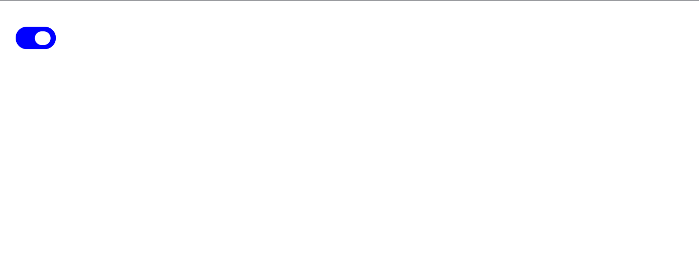
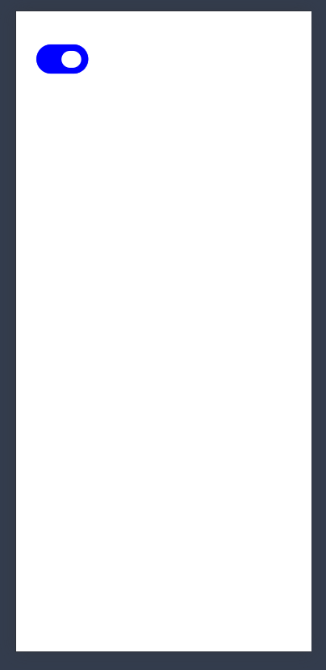

# Toggle Switch Animation 🔄

### 💻 Laptop View:


### 📱 Mobile View:


This project creates a simple **toggle switch animation**, allowing users to switch between "On" and "Off" states.

## 📂 Project Structure

- `index.html` – HTML file (structure)
- `style.css` – CSS file (animation & design)

## ✨ Features

✔️ Toggle switch functionality  
✔️ Smooth CSS animations  

## 🚀 How to Use

1. Clone this repository:
   ```bash
   git clone https://github.com/Faridun11/OFF-ON1.git
